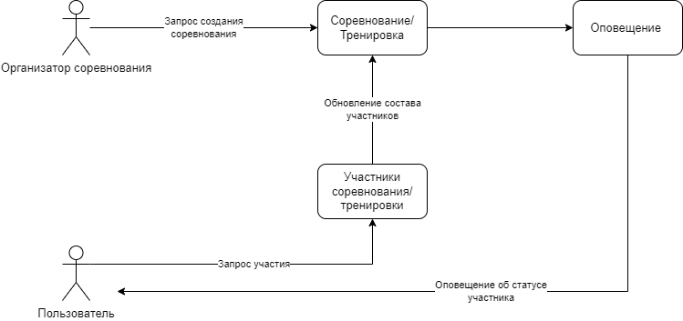
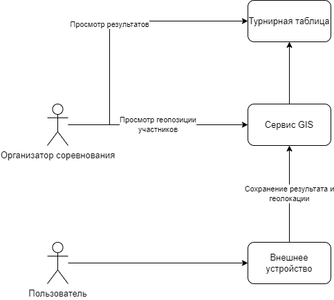

## Основные представления
a.	Функциональное.
 

  

b.	Информационное.
 
**Создание соревнования/тренировки**

  

c.	Многозадачность (concurrency).
 
**Использование функционала постоянно обновляемых данных в контексте проведения соревнований с постоянным перемещением по местности**
 

d.	Инфраструктурное.
 

  

e.	Безопасность.
 
Обеспечение безопасности приложения достигается за счет соблюдения следующих пунктов
- Использования шифрования для персональных данных
- Использования протокола HTTPS для доступа к API
- Использования MTLS для взаимодействия между сервисами
- Использование OAuth2.0 для аутентификации
- Применение prepare-statement зарпросов на уровне сервисов
- Использование механизма тротлинга запросов для получения realtime-данных во время соревнований
- Использование механизма round robin для балансировки нагрузки на сервисы