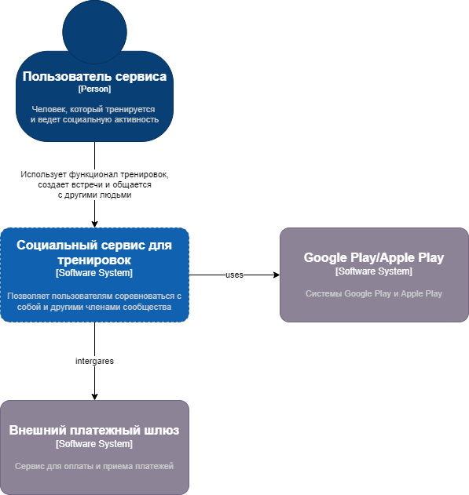

## Разработка концептуальной архитектуры.

Контекстная диаграмма

## Описание рисков реализации (бизнес и технические).
Технические риски:
- Риск нехватки оборудования
- Риск обеспечения интеграция со всеми типами устройств
- Риск обеспечения хранения персональных данных

Бизнес риски:
- Недостаточное вовлечение пользователей
- Недостаток финансирования для разработки и поддержания инфраструктуры

## План поэтапной разработки и расширения системы, анализ критически важных компонентов.
1. Разработка социальной сети
    1. Ведение блога
    2. Обмен сообщениями
2. Создание тренировок
    1. Возможность разработки своих тренировок
    2. Рекомендательная система тренировок
    3. Система рейтинга
3. Функционал для офлайн мероприятий
    1. Календарь офлайн встреч
    2. Карты маршрутов
4. Предложения партнеров
    1. Интегерация предложений партнеров
    2. Персональные рекомендации
5. Подключение внешних устройств и мониторинг

## Выделение критических бизнес-сценариев.
- Регистрация и аутентификация с помощью OpenID
- Публикация своих постов и фото
- Просмотр календаря встреч

## Атрибуты качества (выделить основные, например: наблюдаемость).
- Наблюдаемость (Мониторинг сервисов и инфраструктуры)
- Информационная безопасность (Обеспечение хранения персональных данных)
- Производительность (Обеспечение требуемого отклика сервисов)
- Масштабируемость (Возможность обеспечивать работоспособность сервиса с учетом нагрузки)

## Анализ и список нефункциональных требований.
- Доступность (Значение % при котором пользователь имеет доступ к ресурсу)
- Масштабируемость (Значение % при котором пользователь имеет доступ к ресурсу)
- Надежность (сохранение данных, восстанавление после сбоя)
- Отказоустойчивость (Число пользователей в единицу времени, число запросов в единицу времени)
- Работоспособность (Среднее время между сбоями, Среднее время для восстановления)
- Безопасность (Защита перс. данных)
- Внешние интерфейсы (Интеграция с платежными сервисами, доступность внешних систем для оплаты услуг и товаров партнеров)
- Требования к удобству использования (Число переходов между страницами)

## Анализ и описание архитектурных опций и обоснование выбора.

**Социальная сеть**
Для функционала сети возможно использовать готовые Open Source решения.

Сравнительный анализ:
 

|Решение   | Стек  | Костоимзация шаблонов  |  Маштабирование | Сложность доработки  |
|---|---|---|---|---|
| HumHub  | PHP  | Простая  | Нет  | Высокая  |
| Elgg  | PHP  | Простая  | Поддерживается  | Высокая  |
| BuddyPress  | PHP  | Сложная  | Ограничено  | Средняя  |
| Diaspora  | Ruby  | Простая  | Ограничено  | Высокая  |
| Tribe  | JavaScript, Ruby  |  Сложная | Нет  | Высокая  |

Исходя из бизнес требований, оценка самостоятельной разработки выглядит более целесообразным решением.

**Сервис тренировок**
Необходимо самостоятельное решение с учетом функций персонализации и использовании GIS.

**Интеграция с внешними устройствами**
Допущение: необходимо кросплатформенное (Android/iOS) решение для разработки PoC.
 
Интегерация возможна с применением библиотек для разработки кросплатформенных решений. Flutter, React Native и т.д.