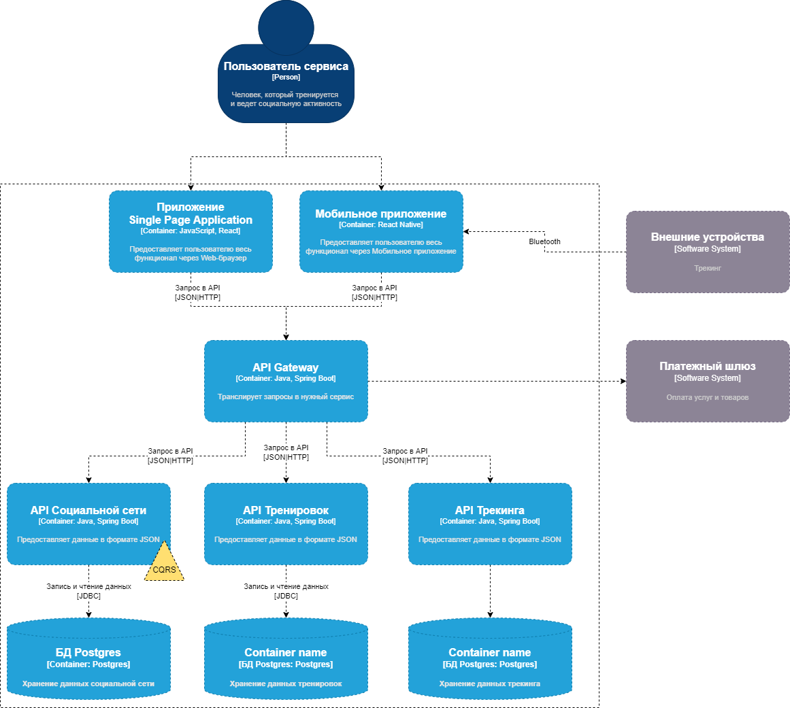
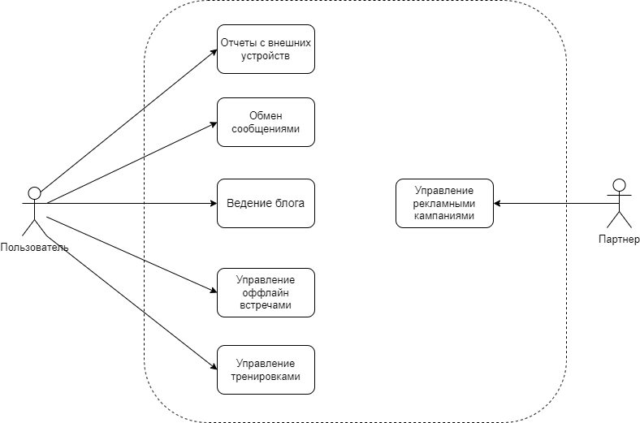
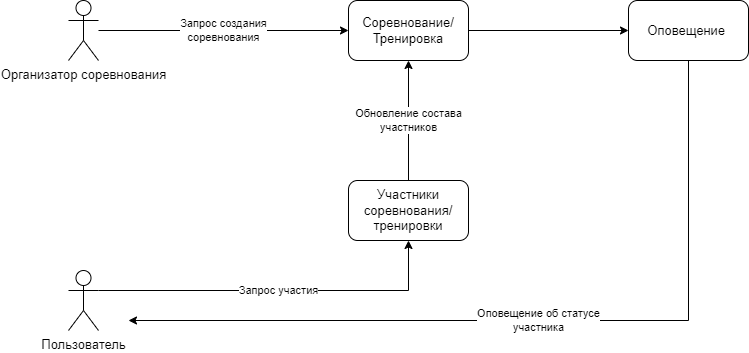
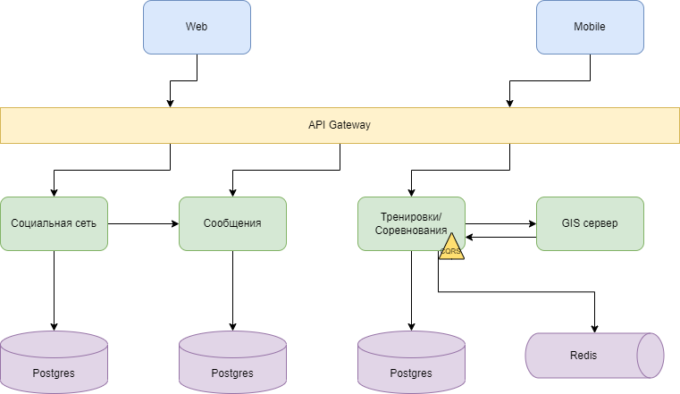

## Список ADR
- Языки программирования разработки
- Архитектурный стиль приложения. Выделение сервисов
- Форматы и протоколы обмена сообщениями между частями системы
- Архитектура сервиса "Социальная сеть" 
- Архитектура сервиса "Тренировки"
- Архитектура сервиса интеграции с Внешними устройствами
- Безопасность хранения персональных данных в БД

## Описание сценариев использования приложения
Предпосылки: пользователь аутентифицирован и авторизован.

**Социальная сеть**
Написание поста:
1. Пользователь открывает страницу для создания поста
2. Пользователь наполняет пост текстом и изображениями
3. Пользователь сохраняет пост

Общение:
1. Пользователь открывает список друзей
2. Выбирает друга
3. Открывается окно для написания сообщения
4. Пользователь пишет сообщение и отправляет его
5. Друг получает уведомление что ему отправлено сообщение

**Сервис тренировок**
1. Пользователь указывает интересующие фильтры для тренировок
2. Сервис на основе предпочтений составляет программу тренировок и формирует расписание
3. При возникновении события тренировки, пользователь отмечает тренировку

## Базовая архитектура с учётом ограничений бизнес-требований, НФТ, выбранной архитектуры, адресация атрибутов качества

## Основные представления
a.	Функциональное.
 

b.	Информационное.
 
**Создание соревнования/тренировки**

c.	Многозадачность (concurrency).
 
**Использование функционала постоянно обновляемых данных в контексте проведения соревнований с постоянным перемещением по местности**
 

d.	Инфраструктурное.
 

e.	Безопасность.
 
Обеспечение безопасности приложения достигается за счет соблюдения следующих пунктов
- Использования шифрования для персональных данных
- Использования протокола HTTPS для доступа к API
- Использования MTLS для взаимодействия между сервисами
- Использование OAuth2.0 для аутентификации
- Применение prepare-statement зарпросов на уровне сервисов
- Использование механизма тротлинга запросов для получения realtime-данных во время соревнований
- Использование механизма round robin для балансировки нагрузки на сервисы